# JOBSHEET 9

# PERCOBAAN 

## - Percobaan 1 : Mengisi Elemen Array 

## - Percobaan 1 : Verifikasi Hasil Percobaan


_Pertanyaan:_

1.  Jika isi masing-masing elemen array bil diubah dengan angka 5.0, 12867, 7.5, 2000000.
Apa yang terjadi? Mengapa bisa demikian?
2.  Modifikasi kode program di atas dengan melakukan inisialisasi elemen array sekaligus
pada saat deklarasi array.
3.  Ubah statement pada langkah No 4 menjadi seperti berikut
    ```java
        for (int i = 0; i < 4; i++) {
            System.out.println(bil[i]);
        } 
    ```
    Apa keluaran dari program? Jelaskan maksud dari statement tersebut.
4.  Jika kondisi pada statement for-loop di atas diubah menjadi: i <= 4, apa keluaran
    dari program? Mengapa demikian?

_Jawaban:_

1.  Yang akan terjadi 


    - Alasannya : Elemen array bertipe int hanya bisa diisi bilangan bulat (tanpa koma). 
    Jika ingin menyimpan angka pecahan seperti 5.0 atau 7.5 harus mengubah tipe array menjadi double

2.  Modifikasi : 

    ```java 
            public class ArrayBilangan4 {
            public static void main(String[] args) {

            // Array bertipe integer dengan nama bil dengan kapasitas 4 elemen
            int [] bil = {5, 13, -7, 17};

         // Output
            System.out.println(bil[0]);
            System.out.println(bil[1]);
            System.out.println(bil[2]);
            System.out.println(bil[3]);
     }
    }
    ```

    - Penjelasan : int [] bil = {5, 13, -7, 17};
    - Artinya, Java otomatis tahu panjang array-nya 4 elemen dari jumlah data yang diisi. Jadi tidak perlu lagi menulis new int[4] dan mengisi satu-satu
3.  Modifikasi : 

    ```java 
            public class ArrayBilangan4 {
            public static void main(String[] args) {

            // Array bertipe integer dengan nama bil dengan kapasitas 4 elemen
            int [] bil = {5, 13, -7, 17};

            // Output
            for (int i = 0; i < 4; i++) {
                System.out.println(bil[i]);
            }
        }
    }
    ```

    Penjelasan : for (int i = 0 < 4; i++)
                - Perulangan dimulai dari i = 0 sampai i < 4 (berarti i bernilai 0, 1, 2, 3).
                - Karena array punya 4 elemen, perulangan akan mengakses semua elemen array.
4.  Output dari program : 


    Penjelasan : - Karena array hanya punya 4 elemen (indeks 0-3), maka bil [4] tidak ada
                 - Kondisi i <= 4 membuat loop mencoba mengakses indeks ke-4, yang keluar dari batas array, sehingga program error

## - Percobaan 2 : Studi Kasus Nilai Mahasiswa di SIAKAD - Meminta Inputan Pengguna untuk Mengisi Elemen Array 

## - Percobaan 2 : Verifikasi Hasil Percobaan

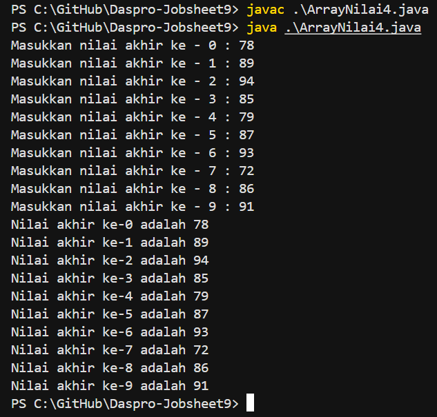

_Pertanyaan:_

1.  Ubah statement pada langkah nomor 5 menjadi seperti berikut ini : 
    ```java 
        for (int i = 0; i < nilaiAkhir.length; i++) {
            System.out.print("Masukkan nilai akhir ke - " + i + " : ");
            nilaiAkhir[i] = input.nextInt();            
        }
    ``` 
    Jalankan program. Apakah terjadi perubahan? Mengapa demikian?
2.  Apa yang dimaksud dengan kondisi: i < nilaiAkhir.length ? 
3.  Ubah statement pada langkah nomor 6 menjadi seperti berikut ini, sehingga program hanya menampilkan nilai
    Mahasiswa yang lulus saja (yaitu mahasiswa yang memiliki nilai > 70) : 

    ```java 
         for (int i = 0; i < nilaiAkhir.length; i++) {
            if (nilaiAkhir[i] > 70) {
                System.out.println("Nilai akhir ke-" + i + "lulus!");
            }
        }
    ```
    Jalankan program dan jelaskan alur program!
4.  Modifikasi program agar menampilkan status      kelulusan semua mahasiswa berdasarkan nilai, yaitu dengan menampilkan status mana mahasiswa yang lulus dan tidak lulus, seperti ilustrasi output berikut : 

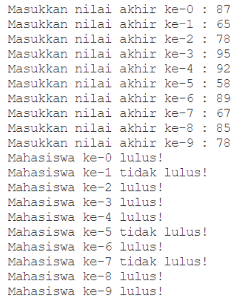

_Jawaban:_

1.  Tidak ada perubahan hasil (output program tetap sama). Program tetap meminta input 10 nilai dan menampilkannya kembali seperti sebelumnya.
    - Alasannya : nilaiAkhir.length adalah panjang array, yaitu 10 (jumlah elemen yang bisa disimpan). Jadi, secara logika i < nilaiAkhir.length artinya i < 10, yang sama persis dengan perulangan sebelumnya.
2.  Selama nilai i masih lebih kecil dari panjang array (nilaiAkhir.length), maka perulangan akan terus berjalan. Saat i sudah tidak lebih kecil (sudah sama dengan panjang array), maka perulangan berhenti.
3.  - Kode : for (int i = 0; i < nilaiAkhir.
    length; i++)
    Penjelasan : Ini adalah perulangan (loop) yang akan berjalan sebanyak jumlah elemen array nilaiAkhir. nilaiAkhir.length menunjukkan panjang array, misalnya 10. Jadi i akan bernilai : 0, 1, 2, 3, 4, 5, 6, 7, 8, 9. Program akan memeriksa setiap elemen array satu per satu.

    - Kode : if (nilaiAkhir[i] > 70)
    Penjelasan : Ini adalah kondisi pengecekan (seleksi). Jika nilai mahasiswa pada indeks ke-i lebih dari 70, maka mahasiswa tersebut lulus. Kalau syarat benar (true), baris di dalam if akan dijalankan. Kalau syarat salah (false), baris di dalam if dilewati (tidak melakukan apa-apa).

    - Kode : System.out.println("Nilai akhir ke-" + i + " Lulus! ")
    Penjelasan : Baris ini hanya dijalankan kalau kondisi if di atas terpenuhi. Program akan menampilkan output seperti ini "Nilai akhir ke-3 Lulus!". + i + berfungsi untuk menyisipkan nomor indeks ke dalam teks.
4.  Code :
    ```java
            import java.util.Scanner;

            public class ArrayNilai4 {
            public static void main(String[] args) {
                Scanner input = new Scanner(System.in);

                // Deklarasi array bertipe integer dengan
                // nama nilaiAkhir dan berkapasitas 10 elemen
                int[] nilaiAkhir = new int[10];
        
                for (int i = 0; i < nilaiAkhir.length; i++) {
                    System.out.print("Masukkan nilai akhir ke - " + i + " : ");
                    nilaiAkhir[i] = input.nextInt();            
                }
                for (int i = 0; i < nilaiAkhir.length; i++) {
                    if (nilaiAkhir[i] >= 70) {
                    System.out.println("Nilai akhir ke-" + i + " Lulus! ");
                } else {
                    System.out.println("Nilai akhir ke-" + i + " Tidak Lulus! ");
                }
            }
            input.close();
        }
    }
    ```
Output :

 

## - Percobaan 3 : Studi Kasus Nilai Mahasiswa di SIAKAD - Melakukan Operasi Aritmatika terhadap Elemen Array 

## - Percobaan 3 : Verifikasi Hasil Percobaan

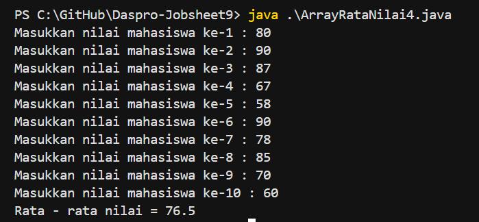

_Pertanyaan:_ 

1.  Modifikasi kode program pada praktikum percobaan 3 di atas (ArrayRataNilaiXX.java) agar program dapat menampilkan banyaknya mahasiswa yang lulus, yaitu mahasiswa yang memiliki lebih besar dari 70 (>70).
2.  Modifikasi program pada praktikum percobaan 3 di atas (ArrayRataNilaiXX.java) sehingga program menerima jumlah elemen berdasarkan input dari pengguna dan mengeluarkan output seperti berikut ini:
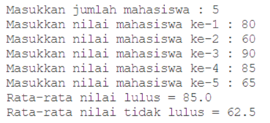

_Jawaban:_

1.  Code : 
    ```java 
            import java.util.Scanner;

            public class ArrayRataNilai4 {
                public static void main(String[] args) {
                    Scanner input = new Scanner(System.in);

                    // Membuat array nilaiMhs bertipe integer dengan kapasitas 10. 
                    // Kemudian mendeklarasi variable total dan rata2
                    int[] nilaiMhs = new int [10];
                    double total = 0;
                    double rata2;
                    int jumlahLulus = 0; // untuk menghitung mahasiswa yang lulus

                    // Mengisi array nilaiMhs dengan nilai dari input pengguna
                    for (int i = 0; i < nilaiMhs.length; i++) {
                        System.out.print("Masukkan nilai mahasiswa ke-"+ (i+1) +" : ");
                            nilaiMhs [i] = input.nextInt();
                    }
        
                    // Menggunakan perulangan untuk menghitung jumlah 
                    // keseluruhan nilai dalam array nilaiMhs
                    for (int i = 0; i < nilaiMhs.length; i++) {
                        total = total + nilaiMhs[i];

                    // Jika nilai mahasiswa lebih dari 70, menambahkan jumlahLulus
                        if (nilaiMhs[i] > 70) {
                            jumlahLulus++;
                        }
                    }

                    // Menghitung nilai rata-rata dengan cara nilai 
                    // total dibagi jumlah elemen dari array nilaiMhs
                    rata2 = total/nilaiMhs.length;

                    // Output 
                    System.out.println("-------------------------------------");
                    System.out.println("Rata - rata nilai = " + rata2);
                    System.out.println("Jumlah mahasiswa yang lulus = " + jumlahLulus);

                    input.close();
                }
            }
    ```
Output :

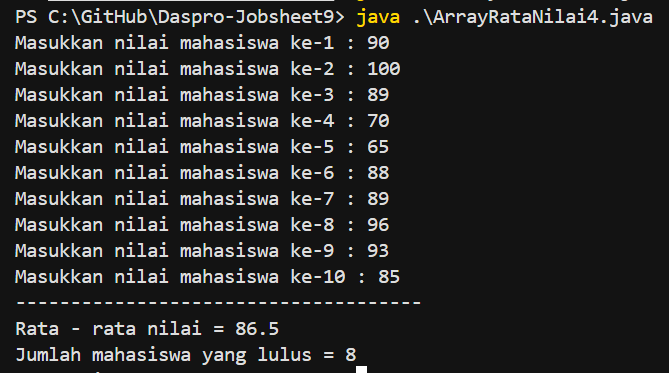

2.  Code : 
    ```java 
            import java.util.Scanner;

            public class ArrayRataNilai4 {
                public static void main(String[] args) {
                    Scanner input = new Scanner(System.in);

                    // Input jumlah mahasiswa 
                    System.out.print("Masukkan jumlah mahasiswa : ");
                    int jumlahMhs = input.nextInt();

                    // Membuat array dengan ukuran sesuai input pengguna 
                    int[] nilaiMhs  = new int[jumlahMhs];

                    // Membuat array nilaiMhs bertipe integer dengan kapasitas 10. 
                    // Kemudian mendeklarasi variable total dan rata2
                    double totalLulus = 0;
                    double totalTidakLulus = 0;
                    int jumlahLulus = 0; // untuk menghitung mahasiswa yang lulus
                    int jumlahTidakLulus = 0;

                    // Mengisi array nilaiMhs dengan nilai dari input pengguna
                    for (int i = 0; i < nilaiMhs.length; i++) {
                        System.out.print("Masukkan nilai mahasiswa ke-"+ (i+1) +" : ");
                        nilaiMhs [i] = input.nextInt();
                    }
        
                    // Menghitung total nilai lulus dan tidak lulus
                    for (int i = 0; i < nilaiMhs.length; i++) {
                        if (nilaiMhs[i] > 70) {
                            totalLulus = totalLulus + nilaiMhs[i];
                            jumlahLulus++;
                    } else {
                            totalTidakLulus = totalTidakLulus + nilaiMhs[i];
                            jumlahTidakLulus++;
                    } 
                }

                    // Menghitug rata - rata 
                    double rata2Lulus = 0, rata2TidakLulus = 0;

                    if (jumlahLulus > 0) {
                        rata2Lulus = totalLulus / jumlahLulus;
                    }
                    if (jumlahTidakLulus > 0) {
                        rata2TidakLulus = totalTidakLulus / jumlahTidakLulus;
                    }

                    // Output 
                    System.out.println("-------------------------------------");
                    System.out.println("Rata - rata nilai lulus = " + rata2Lulus);
                    System.out.println("Rata - rata nilai tidak lulus = " + rata2TidakLulus);

                    input.close();
                }
            }
    ```
Output : 

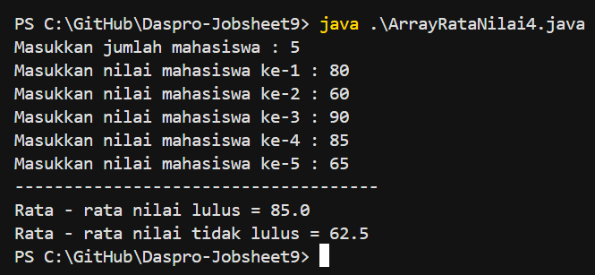

## - Percobaan 4 : Searching 

# - Percobaan 4 : Verifikasi Hasil Percobaan

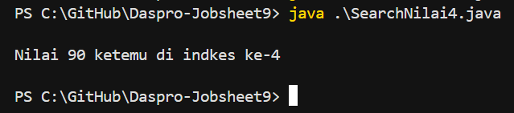

_Pertanyaan:_

1.  Jelaskan maksud dari statement break; pada baris ke-10 kode program percobaan 4 di
atas.
2.  Modifikasi kode program pada percobaan 4 di atas sehingga program dapat menerima
input berupa banyaknya elemen array nilai, isi array, dan sebuah nilai (key) yang ingin
dicari. Lalu cetak ke layar indeks posisi elemen dari nilai (key) yang dicari. Contoh hasil
program:

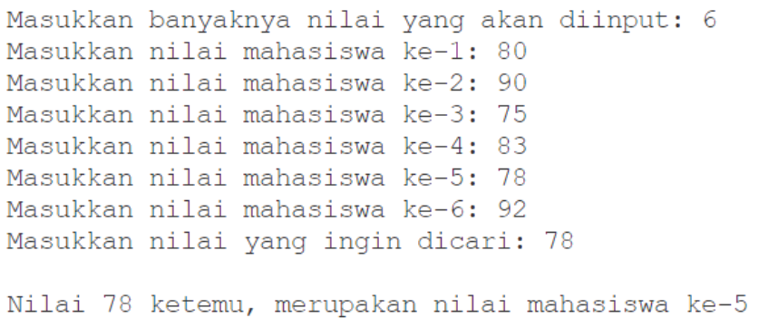

3.  Modifikasi program pada percobaan 4     di atas, sehingga program akan memberikan pesan
"Nilai yang dicari tidak ditemukan" jika nilai yang dicari (key) tidak ada di dalam array.
Contoh tampilan program sebagai berikut:

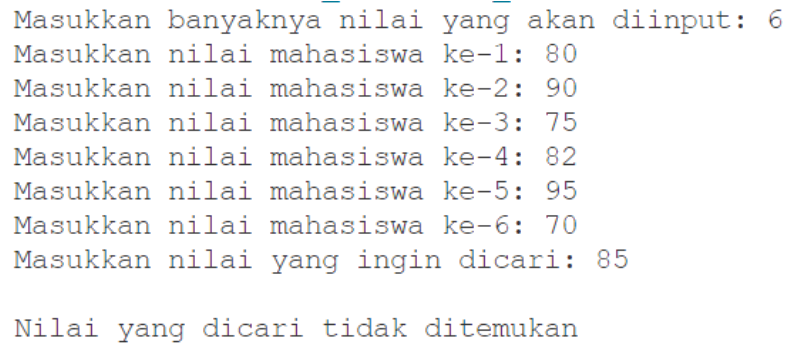

_Jawaban:_ 

1.  Penjelasan dari statement break; 
    - break; digunakan untuk keluar dari perulangan for secara langsung, meskipun kondisi i < arrNilai.length masih benar.
    - Jadi ketika nilai yang dicari (key) sudah ditemukan di array, perulangan tidak perlu dilanjutkan lagi.
    Kesimpulan : Jadi, break; artinya menghentikan perulangan seketika saat kondisi tertentu terpenuhi. Pada program ini, break; berfungsi untuk menghentikan pencarian nilai setelah data ditemukan, supaya program lebih efisien (tidak melakukan pengecekan yang tidak perlu).
2.  Code : 
    ```java 
            import java.util.Scanner;

            public class SearchNilai4 {
                public static void main(String[] args) {
                    Scanner input = new Scanner(System.in);

                    // Input banyaknya nilai (jumlah elemen array)
                    System.out.print("Masukkan banyaknya nilai yang akan diinput: ");
                    int jumlah = input.nextInt();

                    // Deklarasi array dengan ukuran sesuai input pengguna 
                    int[] arrNilai = new int[jumlah];

                    // Input nilai - nilai mahasiswa 
                    for (int i = 0; i < arrNilai.length; i++) {
                        System.out.print("Masukkan nilai mahasiswa ke-" + (i+1) + " : ");
                        arrNilai[i] = input.nextInt();
                    }

                    // Input nilai yang ingin dicari 
                    System.out.print("Masukkan nilai yang ingin dicari : ");
                    int key = input.nextInt();

                    // Variabel untuk menyimpan posisi hasil pencarian 
                    int hasil = -1; // -1 berarti belum ditemukan 

                    // Proses pencarian nilai dalam array 
                    for (int i = 0; i < arrNilai.length; i++) {
                        if (key == arrNilai[i]) {
                            hasil = i;
                            break; // langsung berhenti setelah ketemu 
                        }
                    }
                    System.out.println(); // baris kosong 

                    // Menampilkan hasil pencarian 
                    if (hasil != -1) {
                        System.out.println("Nilai " + key + " ketemu, merupakan nilai mahasiswa ke-" + (hasil + 1));
                    }
                    input.close();
                }
            }
    ```
Output : 

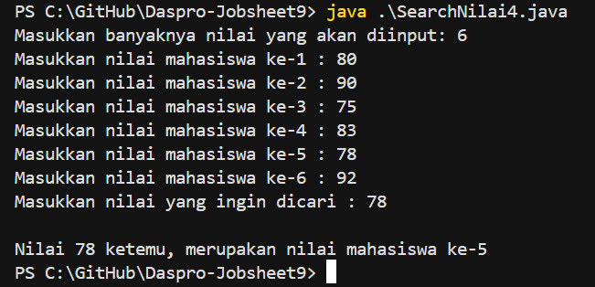

3.  Code : 
    ```java 
            import java.util.Scanner;

            public class SearchNilai4 {
                public static void main(String[] args) {
                    Scanner input = new Scanner(System.in);

                    // Input banyaknya nilai (jumlah elemen array)
                    System.out.print("Masukkan banyaknya nilai yang akan diinput: ");
                    int jumlah = input.nextInt();

                    // Deklarasi array dengan ukuran sesuai input pengguna 
                    int[] arrNilai = new int[jumlah];

                    // Input nilai - nilai mahasiswa 
                    for (int i = 0; i < arrNilai.length; i++) {
                        System.out.print("Masukkan nilai mahasiswa ke-" + (i+1) + " : ");
                        arrNilai[i] = input.nextInt();
                    }

                    // Input nilai yang ingin dicari 
                        System.out.print("Masukkan nilai yang ingin dicari : ");
                        int key = input.nextInt();

                    // Variabel untuk menyimpan posisi hasil pencarian 
                    int hasil = -1; // -1 berarti belum ditemukan 

                    // Proses pencarian nilai dalam array 
                    for (int i = 0; i < arrNilai.length; i++) {
                        if (key == arrNilai[i]) {
                        hasil = i;
                        break; // langsung berhenti setelah ketemu 
                    }
                }
                System.out.println(); // baris kosong 

                // Menampilkan hasil pencarian 
                if (hasil != -1) {
                    System.out.println("Nilai " + key + " ketemu, merupakan nilai mahasiswa ke-" + (hasil + 1));
                } else { 
                    System.out.println("Nilai " + key + " yang dicari tidak ditemukan");
                }
                input.close();
            }
        }
    ```
Output : 

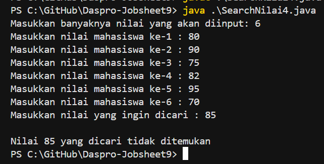

# TUGAS 

## Tugas 1

1.  Code : 
    ```java 
            import java.util.Scanner;

            public class NilaiMahasiswa4 {
                public static void main(String[] args) {
                Scanner input = new Scanner(System.in);


                // Input banyaknya nilai mahasiswa yang akan diinput
                System.out.println("--- PROGRAM MENYIMPAN DAN MENGELOLA NILAI MAHASISWA ---");
                System.out.print("Masukkan banyak nilai mahasiswa yang akan diinput : ");
                int jumlah = input.nextInt();

                // Deklarasi array dengan ukuran sesuai input user 
                int[] nilai = new int[jumlah]; 

                // Input nilai-nilai mahasiswa menggunakan array dari input pengguna 
                for (int i = 0; i < nilai.length; i++) {
                    System.out.print("Masukkan nilai mahasiswa ke-" + (i+1) + " : ");
                    nilai[i] = input.nextInt();
                }
                System.out.println();

                // Menghitung total nilai
                int totalNilai = 0;
                double rata2;

                for (int i = 0; i < nilai.length; i++) {
                    totalNilai = totalNilai + nilai[i];
                }

                // Menghitung rata-rata
                rata2 = totalNilai / jumlah;

                System.out.println("--- RATA - RATA ---");
                System.out.println("Nilai rata-rata : " + rata2);

                System.out.println();

                // Menampilkan nilai tertinggi dan terendah
                int nilaiTertinggi = 0;
                int nilaiTerendah = 100;

                for (int i = 0; i < nilai.length; i++) {

                    if (nilai[i] > nilaiTertinggi) {
                        nilaiTertinggi = nilai[i];
                    } else if (nilai[i] < nilaiTerendah) {
                        nilaiTerendah = nilai[i];
                    }
                }

                // Output 
                System.out.println("--- NILAI TERTINGGI DAN NILAI TERENDAH ---");
                System.out.println("Nilai tertinggi : " + nilaiTertinggi);
                System.out.println("Nilai terendah  : " + nilaiTerendah);

                System.out.println();

                System.out.println("--- NILAI YANG DIINPUTKAN ---");
                for (int i = 0; i < nilai.length; i++) {
                    System.out.println("Nilai mahasiswa ke-" + (i+1) + " : " + nilai[i]);
                }
                input.close();
            }
        }
    ```
Output :
 
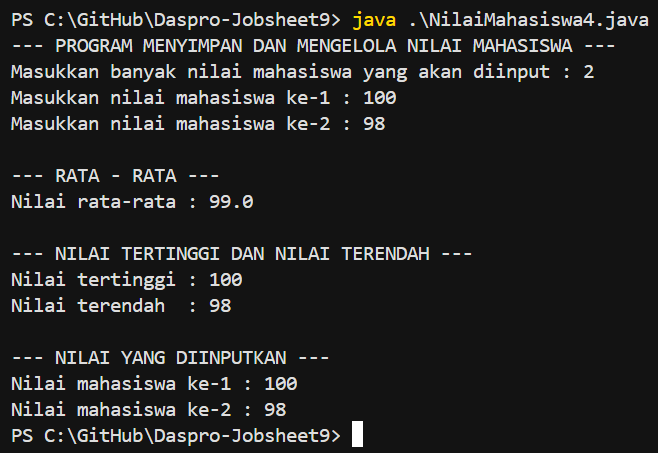

2.  Code : 
    ```java
            import java.util.Scanner;

            public class Cafe4 {
                public static void main(String[] args) {
                    Scanner input = new Scanner(System.in);

                    // Input jumlah pesanan
                    System.out.println("--- SELAMAT DATANG DI CAFE MOON CAFE ---");
                    System.out.print("Masukkan jumlah pesanan : ");
                    int jumlah = input.nextInt();

                    // Deklarasi dan instansiasi pesanan dan harga
                    String[] pesanan = new String[jumlah];
                    int[] harga = new int[jumlah];

                    for (int i = 0; i < jumlah; i++) {
                        System.out.print("Masukkan nama pesanan (makanan/minuman) ke-" + (i+1) + "  : ");
                        input.nextLine();
                        pesanan[i] = input.nextLine();
                        System.out.print("Masukkan harga pesanan (makanan/minuman) ke-" + (i+1) + " : " + "Rp.");
                        harga[i] = input.nextInt();
                    }
                    System.out.println();

                    // Total harga 
                    int totalHarga = 0;
        
                    for (int i = 0; i < harga.length; i++) {
                        totalHarga = totalHarga + harga[i];
                    }
 
                    // Output pesanan yang diinputkan 
                    System.out.println("--- DAFTAR PESANAN ---");
                    for (int i = 0; i < jumlah; i++) {
                        System.out.println("Pesanan ke-" + (i+1) + " : " + pesanan[i]); 
                        System.out.println("Harga pesanan ke-" + (i+1) + " : "  + "Rp." + harga[i]);
                    }
        
                    // Output total biaya pesanan
                    System.out.println();
                    System.out.println("--- TOTAL BIAYA PESANAN ---");
                    System.out.println("Total biaya pesanan : " + "Rp." + totalHarga);
                    input.close();
                }
            }
    ```
Output :

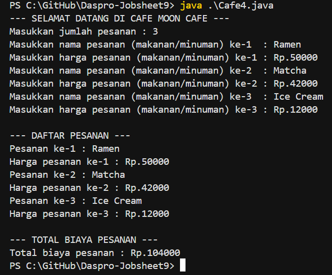

3.  Code :
    ```java 
            import java.util.Scanner;

            public class SearchMenu4 {
                public static void main(String[] args) {
                    Scanner input = new Scanner(System.in);

                    // Deklarasi menu
                    String[] menu = {"Nasi Goreng", "Mie Goreng", "Roti Bakar", "Kentang Goreng", 
                    "Teh Tarik", "Cappucino", "Chocolate Ice"};

                    System.out.println("--- SELAMAT DATANG DI MOON CAFE ---");
                    System.out.println();

                    // Menampilkan daftar menu 
                    System.out.println("Daftar menu : ");
                    for (int i = 0; i < menu.length; i++) {
                        System.out.println((i+1) + ". " + menu[i]);
                    }
                    System.out.println();

                    // Input nama makanan/minuman yang ingin dicari
                    System.out.print("Masukkan nama makanan/minuman yang ingin dicari : ");
                    String search = input.nextLine();

                    // Hasil pencarian -1 karena indeks Array dimulai dari 0
                    int hasil = -1;
        
                    for (int i = 0; i < menu.length; i++) {
                        if (menu[i].equalsIgnoreCase(search)) {
                            hasil = i;
                            break;
                        }
                    }
                    System.out.println();
                    if (hasil != -1) {
                        System.out.println("Pesanan " + search + " tersedia!");
                    } else {
                        System.out.println("Pesanan " + search + " tidak ada di menu!");
                    }
                    System.out.println();
                    System.out.println("--- THANK YOUU ---");
                    input.close();
                }
            }
    ```
Output : 

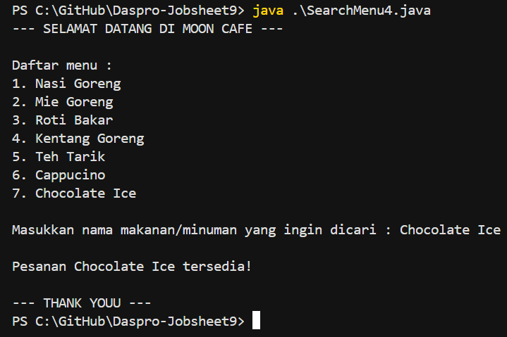


    

