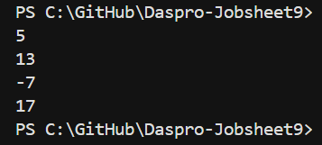
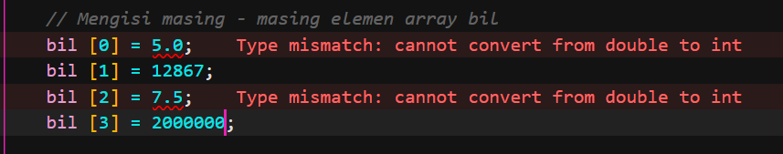
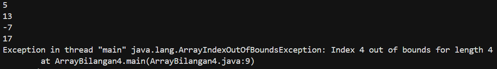

# JOBSHEET 9

# PERCOBAAN 

## - Percobaan 1 : Mengisi Elemen Array 

## - Percobaan 1 : Verifikasi Hasil Percobaan



_Pertanyaan:_

1.  Jika isi masing-masing elemen array bil diubah dengan angka 5.0, 12867, 7.5, 2000000.
Apa yang terjadi? Mengapa bisa demikian?
2.  Modifikasi kode program di atas dengan melakukan inisialisasi elemen array sekaligus
pada saat deklarasi array.
3.  Ubah statement pada langkah No 4 menjadi seperti berikut
    ```java
        for (int i = 0; i < 4; i++) {
            System.out.println(bil[i]);
        } 
    ```
    Apa keluaran dari program? Jelaskan maksud dari statement tersebut.
4.  Jika kondisi pada statement for-loop di atas diubah menjadi: i <= 4, apa keluaran
    dari program? Mengapa demikian?

_Jawaban:_

1.  Yang akan terjadi 



    - Alasannya : Elemen array bertipe int hanya bisa diisi bilangan bulat (tanpa koma). Jika ingin menyimpan angka pecahan seperti 5.0 atau 7.5 harus mengubah tipe array menjadi double
2.  Modifikasi : 

    ```java 
            public class ArrayBilangan4 {
            public static void main(String[] args) {

            // Array bertipe integer dengan nama bil dengan kapasitas 4 elemen
            int [] bil = {5, 13, -7, 17};

         // Output
            System.out.println(bil[0]);
            System.out.println(bil[1]);
            System.out.println(bil[2]);
            System.out.println(bil[3]);
     }
    }
    ```

    - Penjelasan : int [] bil = {5, 13, -7, 17};
    - Artinya, Java otomatis tahu panjang array-nya 4 elemen dari jumlah data yang diisi. Jadi tidak perlu lagi menulis new int[4] dan mengisi satu-satu
3.  Modifikasi : 

    ```java 
            public class ArrayBilangan4 {
            public static void main(String[] args) {

            // Array bertipe integer dengan nama bil dengan kapasitas 4 elemen
            int [] bil = {5, 13, -7, 17};

            // Output
            for (int i = 0; i < 4; i++) {
                System.out.println(bil[i]);
            }
        }
    }
    ```

    Penjelasan : for (int i = 0 < 4; i++)
                - Perulangan dimulai dari i = 0 sampai i < 4 (berarti i bernilai 0, 1, 2, 3).
                - Karena array punya 4 elemen, perulangan akan mengakses semua elemen array.
4.  Output dari program : 



    Penjelasan : - Karena array hanya punya 4 elemen (indeks 0-3), maka bil [4] tidak ada
                 - Kondisi i <= 4 membuat loop mencoba mengakses indeks ke-4, yang keluar dari batas array, sehingga program error


    

